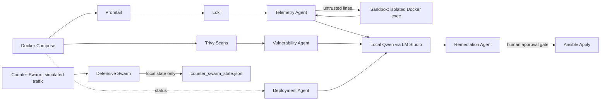

# Architecture

## Components

| Component | Role | Network exposure |
|---|---|---|
| Docker Compose (`docker/`) | Runs Loki, Promtail, Open-WebUI on an `internal: true` network | None outbound; ports published to `127.0.0.1` only |
| Promtail | Tails agent logs, ships to Loki | Internal network only |
| Loki | Stores/queries logs | `127.0.0.1:3100` |
| Open-WebUI | Human-facing chat UI over the local Qwen model | `127.0.0.1:3000` |
| LM Studio | Runs the local Qwen model, exposes an OpenAI-compatible API | `127.0.0.1:1234` (runs on host, outside the container network) |
| Deployment Agent (`agents/deployment_agent.py`) | Runs Ansible, summarizes results via the LLM | Local only |
| Telemetry Agent (`agents/telemetry_agent.py`) | Queries Loki, flags anomalies via the LLM | Local only |
| Vulnerability Agent (`agents/vulnerability_agent.py`) | Runs Trivy (offline DB), triages via the LLM | Local only |
| Remediation Agent (`agents/remediation_agent.py`) | Proposes fixes; deterministic deny-list + human approval gate before execution | Local only |
| Sandbox (`agents/sandbox.py`) | OpenShell-style isolation boundary: runs untrusted-log inspection commands in a disposable, network-none, read-only Docker container | No network namespace at all (`--network none`) |
| Counter-Swarm (`agents/counter_swarm.py`) | Simulated offense/defense loop: synthetic traffic generator + a defensive swarm that "blocks IPs"/"rotates" mock tokens and keys in a local JSON file | Local only, no real network or credential access |
| Dashboard (`web/`) | Static site: architecture diagram, agent status, CVE alerts, remediation log, counter-swarm log | `127.0.0.1:4321` |

## Trust boundaries

- **Agents → LLM:** every agent goes through `agents/common/llm_client.py`, which refuses to
  configure a non-loopback base URL. There is exactly one code path that talks to the model.
- **Untrusted data → LLM:** log content (Telemetry Agent) and scan output (Vulnerability Agent) are
  treated as data to analyze, not instructions — the telemetry agent explicitly wraps log content
  in `<log_data>` containment tags before it reaches the prompt, the same pattern validated in the
  `llm-security-labs` project's lab 2 and lab 5 defenses.
- **Untrusted data → shell:** before the Telemetry Agent's LLM step, `--sandbox-inspect` runs
  structural inspection of the raw log lines inside `agents/sandbox.py`'s disposable container
  (no network, read-only root, capabilities dropped, non-root user, bounded memory/pids/timeout).
  This is the Step-1 "NVIDIA OpenShell" pattern from the lab brief, implemented as a local Docker
  hardening profile rather than a vendored dependency — even a successful prompt-injection payload
  that tricks the model into proposing a shell command has nowhere to escape to.
- **LLM → real actions:** only the Remediation Agent can propose something that executes, and even
  then only after (1) a deterministic deny-list check, independent of the model, and (2) explicit
  human approval — mirroring `llm-security-labs` lab 4's excessive-agency defense.
- **Counter-Swarm → "infrastructure":** `agents/counter_swarm.py` never touches a real firewall,
  token store, or SSH key. Both the offensive traffic and the defensive reactions are synthetic,
  generated in-process, and the only side effect is a local JSON state file the dashboard reads.
  This models the detect → decide → act → log loop for training purposes without the blast radius
  of a real active-response system.
